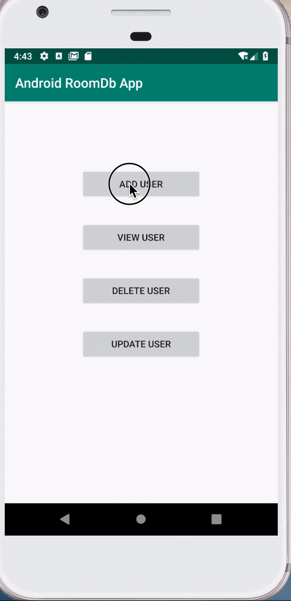
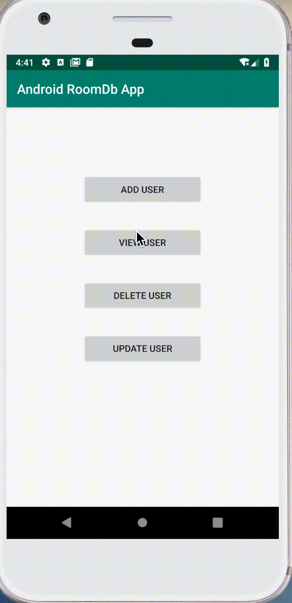
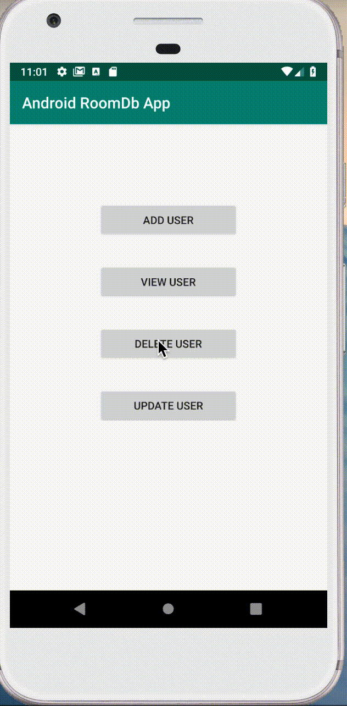

# RoomDatabase App
The project is intended to show an implementation of the ROOM Persistence Library in an Android application. 
It also considers an implementation of several Fragments in a single Activity.

## Why ROOM?
ROOM provides an abstraction layer over SQLite to allow for more robust database access.

## Expected Key Components in this Implementation include;
- Entity (@Entity): Used to create table in the database by using the data model class
- Data Access Object (@Dao): Used to create ways of accessing data in the database,. It can have several abstract methods.
- Database (@Database): This creates an abstraction layer for the Data Access Object.

## Expected Features embedded in the Application include;
- Add User To Database Table
- View All Users
- Delete a User
- Update User Information

## Getting Started
Follow the Instructions below to have the Application running on your machine.

### Prerequisites
- Android Studio
- JDK
- Git
- AVD or Physical device

### Installation
- Clone the repo on the link: https://github.com/moseskamira/RoomDatabaseApp.git
- Import the project into android studio
- Create an android virtual device (AVD) and have it started
- Run the project

## Screenshots
### Adding User To Database Table

### Viewing All Users In The Database Table

### Delete User From Table

## Future Improvements
- Catch App crashing when empty fields are submitted and when duplicate userId is added
- Implement the use of Live Data
- Implement the Update functionality

